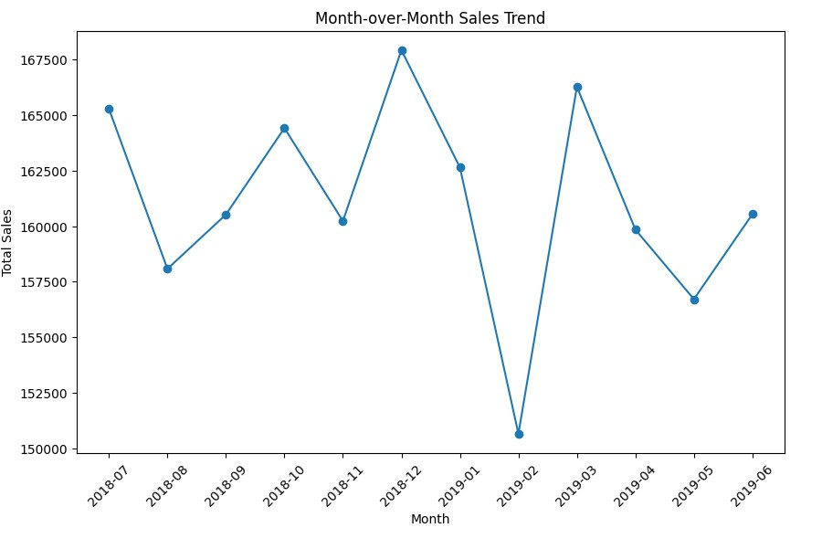

## 1 - Business Objective
Quantium’s supermarket client seeks data-driven insights to inform their strategic plan for increasing chip sales revenue. Currently, the client lacks an in-depth understanding of customer behavior, making it challenging to design targeted marketing campaigns. 
They have collected transaction data for one year (250k+ records) and asked Quantium to provide actionable insights including customer segments and campaign testing.

To address this, we conducted in-depth analysis of customer behavior, transaction KPIs and A/B Testing utilizing SQL and Python. 

Our approach included generating RFM segmentations to classify customers based on their purchasing behavior and developing an A/B testing framework to assess the impact of new store layouts. By selecting appropriate trial and control stores, we ensured a robust evaluation of layout effectiveness.

These insights will enable the client to implement precise marketing strategies and store optimizations, ultimately driving increased transactions and sales revenue.

## 2 - Technical Highlights for Financial and Customer Overview
SQL and Python were utilized for data cleaning - including removing duplicates and dealing with missing values and outliers. Feature Engineering was performed to better understand patterns and trends in the dataset. We established baseline metrics, analyzed MoM trend, store trend and product trends and customer distribution by lifestage and level.

## 3 - RFM Segmentation
RFM segmentation was conducted by calculating recency, frequency and monetary scores for each customer. These scores were used to create 8 customer segments (Champions, Potential Loyalists, Promising, New, About to Sleep, At Risk, Cannot Lose, Hibernating)

## 4 - A/B Testing
Client also wanted to evaluate the revenue impact of new store layout using 3 trial stores. Analytics process included selecting matched control stores, calculating performance lift with statistial testing. For control store selection, we created a similarity score by combining Pearson Correlation with a distance magnitude to identify the most similar control stores and used t-testing to assess statistical significance of results. 

